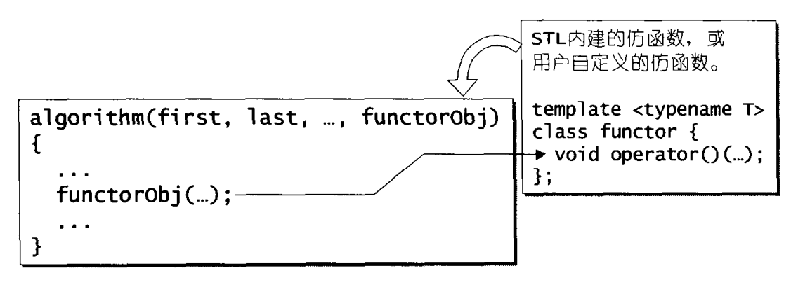

# 仿函数

```txt
代码简述:
  01-functor_test.cpp:一个简单的仿函数
  02-unary_function.cpp:一元函数的仿函数的基类
  03-binary_function.cpp:二元函数的仿函数的基类
  04-arithmetic.cpp:算术类仿函数
  05-relational.cpp:关系运算类仿函数
  06-logical.cpp:逻辑运算仿函数
  07-identity_project_select.cpp:证同、投射、选择
```

## 1. 概述

- 仿函数(函数对象)
- 它是一种具有函数特质的对象
- 它为什么设计成对象形式呢？
  - 泛型编程需要的类型推导
  - 如果不是对象型别则无法推导
- 在STL中用到泛型的地方很多，仿函数为了和STl其它组件进行搭配，就需要设计成类
- 当然，并不只是因为泛型才设计成类，还有很多地方
- 它主要是为了搭配STL算法的



- 仿函数于算法间的关系

- 仿函数的分类：
  - 以操作数划分
    - 一元
    - 二元
  - 功能划分
    - 算数运算
    - 关系运算
    - 逻辑运算

- 使用STL内奸的仿函数需要含入 < functional > 头文件

## 2. 可配接的关键

- 仿函数有能力被函数配接器修饰
- 为了拥有配接能力，每个仿函数必须定义自己的相应型别
  - 配接器能够取出这些型别，获得仿函数的相关信息
  - 相应型别是typedef，不会对程序的执行效率造成影响
- 下面定义两个classes，分别代表一元仿函数和二元仿函数
  - 它们没有任何data members和member functions，只是定义了一些型别
  - 仿函数只需要继承它们其中一个就可以获得相应型别，拥有配接能力

### 2.1. unary_function

- 呈现一元函数的参数型别和返回值型别

### 2.2. binary_function

- 呈现二元函数的第一参数型别、第二参数型别以及返回值型别

## 3. 算术类仿函数

- 算术类仿函数支持
  - 加法
  - 减法
  - 乘法
  - 除法
  - 取余
  - 否定
- 除了否定都是二元运算

- 证同元素
- 运算op的证同元素
  - 数值A若与该元素做op运算，会得到A自己
  - 加法的证同元素为0，因为任何元素加上自己都是自己

## 4. 关系运算类仿函数

- 关系运算类仿函数
  - 等于
  - 不等于
  - 大于
  - 大于或等于
  - 小于
  - 小于或等于

## 5. 逻辑运算符仿函数

- 逻辑运算符仿函数
  - And
  - Or
  - Not(一元)

## 6. 证同、选择、投射

- 间接性是抽象化的重要工具
- 仿函数将传回的参数刻意的选择，不在泛型程序设计中使用最原本的identity、project、select等操作，而划分出一层，都是为了间接性
